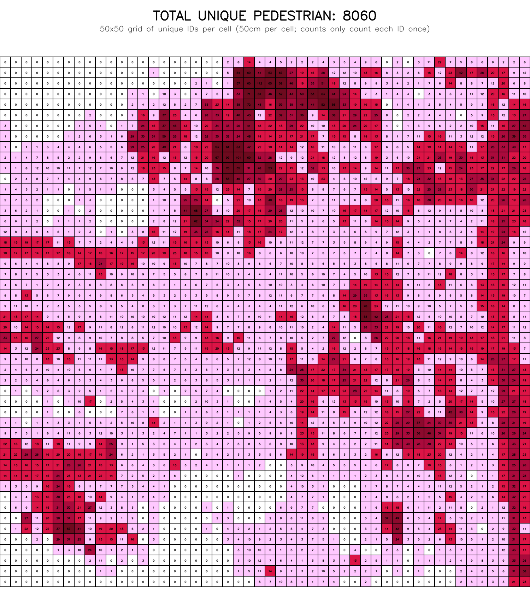
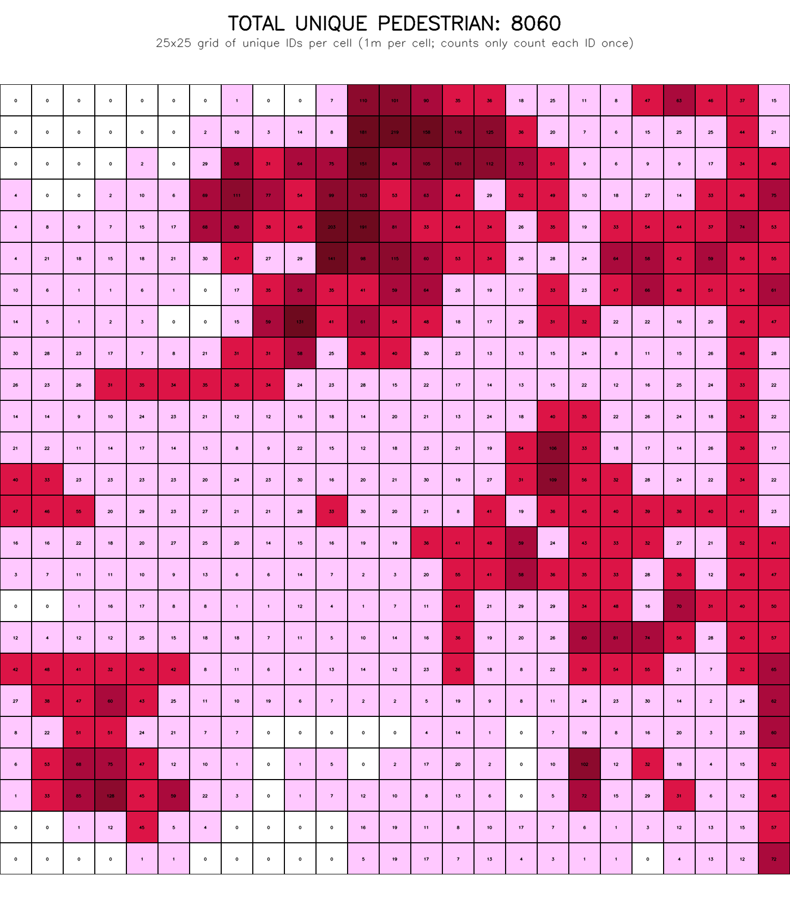

# 4K Aerial Drone Pedestrian Detection and Spatial Analysis

This repository contains a production-oriented pipeline for detecting,
tracking, and spatially analyzing pedestrians from high-altitude 4K drone
video. The system produces per-video artifacts and multi-resolution spatial
visualizations that classify grid cells using Jiang's Head/Tail breaks
algorithm to highlight dense pedestrian corridors.

## Head/Tail Breaks Classification (Concept)

Traditional equal-interval or linear color mappings fail when the underlying
data are heavy-tailed — many cells have low counts while a small number of
cells (corridors) have disproportionately high counts. Head/Tail breaks
(Jiang, 2013) is an iterative mean-splitting method designed for such
distributions:

- Compute the mean of the non-zero cell counts.
- Split the data into _head_ (values > mean) and _tail_ (values <= mean).
- If the head remains a small fraction of the data (heavy-tailed), repeat
  the process on the head.
- Continue until the head is no longer sufficiently small or is too small
  to split further.

We use a 40% (0.4) threshold by default: if the head represents <= 40% of
the current set, we treat the distribution as heavy-tailed and continue
splitting. The algorithm yields successive breakpoints (means) which are
used to form discrete intervals.

## Why Head/Tail for Spatial Pedestrian Mapping

- Heavy-tailed pedestrian counts are common in urban scenes where sidewalks
  and crossings form concentrated corridors.
- Equal-interval bins cluster nearly all cells into the lowest color band,
  masking corridors and reducing interpretability.
- Head/Tail breaks adaptively isolate peaks, producing a small number of
  discrete bands that emphasize high-density corridors while preserving
  low-density tails.

## Discrete Color Mapping

After computing Head/Tail breaks, the visualization maps each interval to a
discrete solid BGR color (no gradients):

- Tail interval: light pink (low density)
- Head intervals: progressively deeper crimson tones

This discrete palette simplifies downstream PNG-based inspection tools that
quantize image pixels back to intervals reliably.

## Multi-Resolution Spatial Grid Pipeline

The pipeline supports multiple spatial grid resolutions simultaneously:

- 50cm × 50cm cells (default high-resolution grid)
- 1m × 1m cells (coarser overview)
- 2m × 2m cells (optional)

For each resolution the system:

1. Accumulates unique `track_id` values per cell (each pedestrian counted
   once per cell regardless of dwell time).
2. Computes Head/Tail breaks on the non-zero cell counts (threshold=0.4).
3. Produces a PNG visualization where each cell is filled with a discrete
   color corresponding to its Head/Tail interval.

## Sample Outputs (Merke12PM)

The following example visual outputs were generated for the `merke12pm` run
and are included under `outputs/merke12pm/`.

50cm grid visualization:



1m grid visualization:



## Quick Start

```bash
python -m venv venv
venv\Scripts\activate
pip install -r requirements.txt
python main.py --input DJI_0715.mp4
```

## Notes and Data Products

- Per-run outputs are written to `outputs/{project_key}/` including
  annotated video, tracking CSV, trajectory JSON, spatial grid PNGs, and
  a research summary JSON.
- Unique-track accumulation ensures counts reflect distinct pedestrians
  rather than raw hits; this is useful for corridor analysis and flow
  estimation.

## License

See `LICENSE` for project licensing information.
